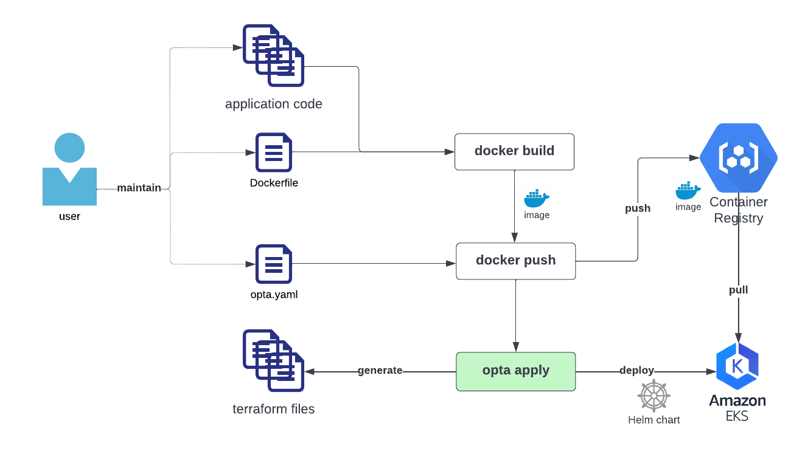

# Bring Your Own Cluster

This is an example of using [Opta](https://github.com/run-x/opta) with an existing EKS cluster.

# What does this do?

This example provides Terraform files to configure Linkerd and Ingress Nginx controller in your EKS cluster to have the target [Network Architecture](https://docs.opta.dev/features/networking/network_overview/).  
Once EKS is configured, you will be able to use Opta to deploy your service to Kubernetes.  
Opta will generate the Terraform files and Helm chart for you, you only need to maintain the Opta file.




# When to use this instead of full Opta?

- Use this guide if you already have an EKS cluster, and would like to use Opta to deploy your Kubernetes services.
- If you don't have an EKS cluser, Opta can create it, check [Getting Started](https://docs.opta.dev/getting-started/) instead.


# What is included?

The following components will be installed:

- [Ingress Nginx](https://github.com/kubernetes/ingress-nginx) to expose services to the public
- [Linkerd](https://linkerd.io/) as the service mesh.
- [AWS Load Balancer Controller](https://kubernetes-sigs.github.io/aws-load-balancer-controller/) to manage the ELB for the Kubernetes cluster.

Here is the break down of the terraform files:

    .
    └── terraform
        ├──aws-lb-iam-policy.json            # The IAM policy for the load balancer
        └──aws-load-balancer-controller.tf   # Create IAM role and install the AWS Load Balancer Controller
        └──data.tf                           # Data fetched from providers
        └──ingress-nginx.tf                  # Install the Nginx Ingres Controller
        └──linkerd.tf                        # Install Linkerd
        └──outputs.tf                        # Terraform outputs
        └──providers.tf                      # Terraform providers
        └──variables.tf                      # Terraform variables

# Requirements

To configure the cluster (this guide), you need to use an AWS user with permissions to create AWS policies and roles, and admin permission on the target EKS cluster.

Additionally, Opta only supports Linkerd for the service mesh at this time.

# Configure the cluster for Opta

This step configures the networking stack (nginx/linkerd/load balancer) on an existing EKS cluster.

- Init terraform
```shell
cd ./terraform
terraform init
```

- [Optional] Configure a Terraform backend. By default, Terraform stores the state as a local file on disk. If you want to use a different backend such as S3, add this file locally.
```terraform
# ./terraform/backend.tf
terraform {
  backend "s3" {
    bucket = "mybucket"
    key    = "path/to/my/key"
    region = "us-east-1"
  }
}
```
Check this [page](https://www.terraform.io/language/settings/backends) for more information or other backends.

- Run terraformm plan
```
terraform plan -var kubeconfig=~/.kube/config -var cluster_name=my-cluster -var oidc_provider_url=https://oidc.eks.... -out=tf.plan

Plan: XX to add, 0 to change, 0 to destroy.
```

For the target EKS cluster:
- For `cluster_name`, run `aws eks list-clusters` to see the availables clusters.
- For `oidc_provider_url`, see `OpenID Connect provider URL` in the EKS cluster page in the AWS console. For more information, check the [official documentation](https://docs.aws.amazon.com/eks/latest/userguide/enable-iam-roles-for-service-accounts.html)
- For `kubeconfig`, check the [official documentation](https://docs.aws.amazon.com/eks/latest/userguide/create-kubeconfig.html) if you don't have one yet.


At this time, nothing was changed yet, you can review what will be created by terraform.

- Run terraformm apply
```
terraform apply tf.plan

Apply complete! Resources: XX added, 0 changed, 0 destroyed.

Outputs:

load_balancer_raw_dns = "xxx"

```

Note the load balancer DNS, this is the public endpoint to access your Kubernetes cluster.

# Additional cluster configuration

These steps are not automated with the terraform step, but you can configure them using these guides.
- Configure DNS
    - Follow this guide: [Routing traffic to an ELB load balancer](https://docs.aws.amazon.com/Route53/latest/DeveloperGuide/routing-to-elb-load-balancer.html)
- Configure a public certificate:
    - Follow this guide: [Requesting a public certificate](https://docs.aws.amazon.com/acm/latest/userguide/gs-acm-request-public.html)
    - Using the certificate ARN, run the terraform commands with `-var load_balancer_cert_arn=...` 

# Configure your service to build and push a docker image

Depending on which CI system you would like to use, configure your service to build and push docker images at each commit.
Here are some pointers for some popular systems: [Github Actions](https://github.com/marketplace/actions/build-and-push-docker-images), [CircleCI](https://circleci.com/docs/2.0/ecs-ecr/), [Jenkins](https://www.jenkins.io/doc/book/pipeline/docker/), [GitLab](https://docs.gitlab.com/ee/ci/docker/using_docker_build.html)

# Deploy a service to Kubernetes with Opta

Instead of having to define a Helm chart folder for each service, you can define one opta file that will take care of generating the Helm chart and use Terraform to apply the changes. 

1. Create the opta file
  ```yaml
  # hello.yaml
  name: hello
  org_name: runx
  input_variables:
    - name: image
  modules:
    - type: k8s-service
      name: hello
      port:
        http: 80
      image: "{vars.image}"
      healthcheck_path: "/"
      public_uri: "/hello"

  ```

2. Run opta to deploy your service to your Kubernetes cluster
  ```shell
  # when running in CI, the image would be the one that was just pushed
  opta apply -c hello.yaml --var image=ghcr.io/run-x/hello-opta/hello-opta:main

  ╒══════════╤══════════════════════════╤══════════╤════════╤══════════╕
  │ module   │ resource                 │ action   │ risk   │ reason   │
  ╞══════════╪══════════════════════════╪══════════╪════════╪══════════╡
  │ hello    │ helm_release.k8s-service │ create   │ LOW    │ creation │
  ╘══════════╧══════════════════════════╧══════════╧════════╧══════════╛

  ...

  Apply complete! Resources: 1 added, 0 changed, 0 destroyed.

  Outputs:

  # the image that is deployed will be confirmed here 
  current_image = "ghcr.io/run-x/hello-opta/hello-opta:main"

  Opta updates complete!
  ```
  This step will:
    - Generate the helm chart for your service
    - Use the terraform helm provider to release the service
    - Store the state of the deployment in K8s as a secret.

3. You can test that your service is deployed by using `kubectl` or `curl` to the public endpoint.
```shell
kubectl -n hello get svc,pod
NAME            TYPE        CLUSTER-IP      EXTERNAL-IP   PORT(S)   AGE
service/hello   ClusterIP   172.20.160.83   <none>        80/TCP    6m42s

NAME                                           READY   STATUS    RESTARTS   AGE
pod/hello-hello-k8s-service-6d55889d55-cvjn8   2/2     Running   0          6m42s

# use "load_balancer_raw_dns" from the step "Configure the cluster for Opta"
curl -k https://$load_balancer_raw_dns/hello
Hello from Opta!
```

# Delete a service from Kubernetes

Use the opta `destroy` command to destroy your service.
All the Kubernetes resources for this service will be deleted.

```shell
opta destroy -c hello.yaml

╒══════════╤══════════════════════════╤══════════╤════════╤══════════╕
│ module   │ resource                 │ action   │ risk   │ reason   │
╞══════════╪══════════════════════════╪══════════╪════════╪══════════╡
│ hello    │ helm_release.k8s-service │ delete   │ HIGH   │ N/A      │
╘══════════╧══════════════════════════╧══════════╧════════╧══════════╛

Apply complete! Resources: 0 added, 0 changed, 1 destroyed.

```
# Uninstall Opta configuration from EKS

- Run terraformm destroy to remove the configuration added for Opta

```
terraform destroy -var kubeconfig=~/.kube/config -var cluster_name=my-cluster -var oidc_provider_url=https://oidc.eks....
```
