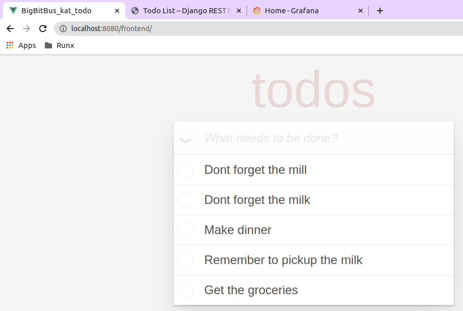
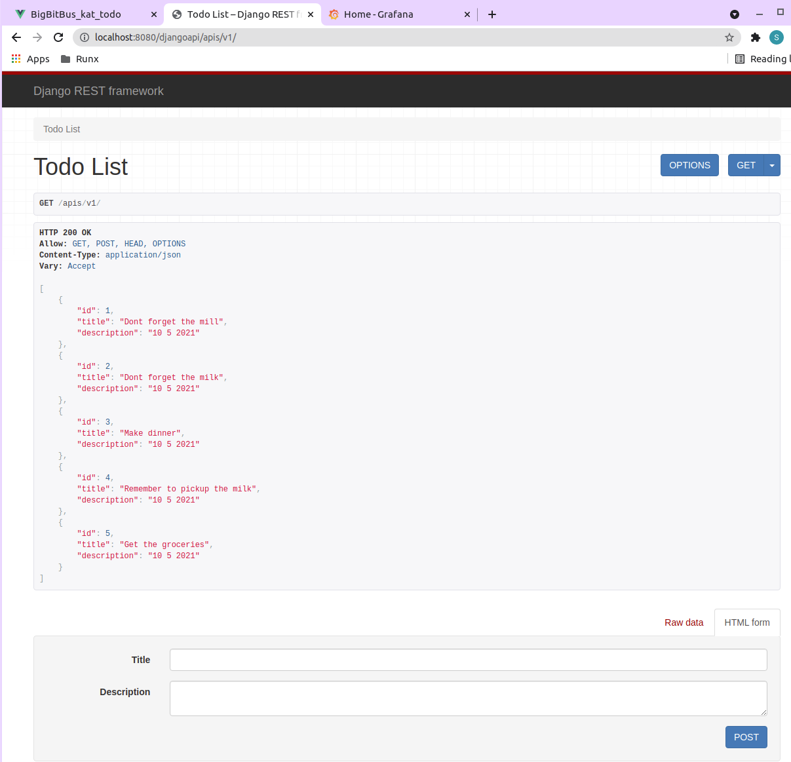
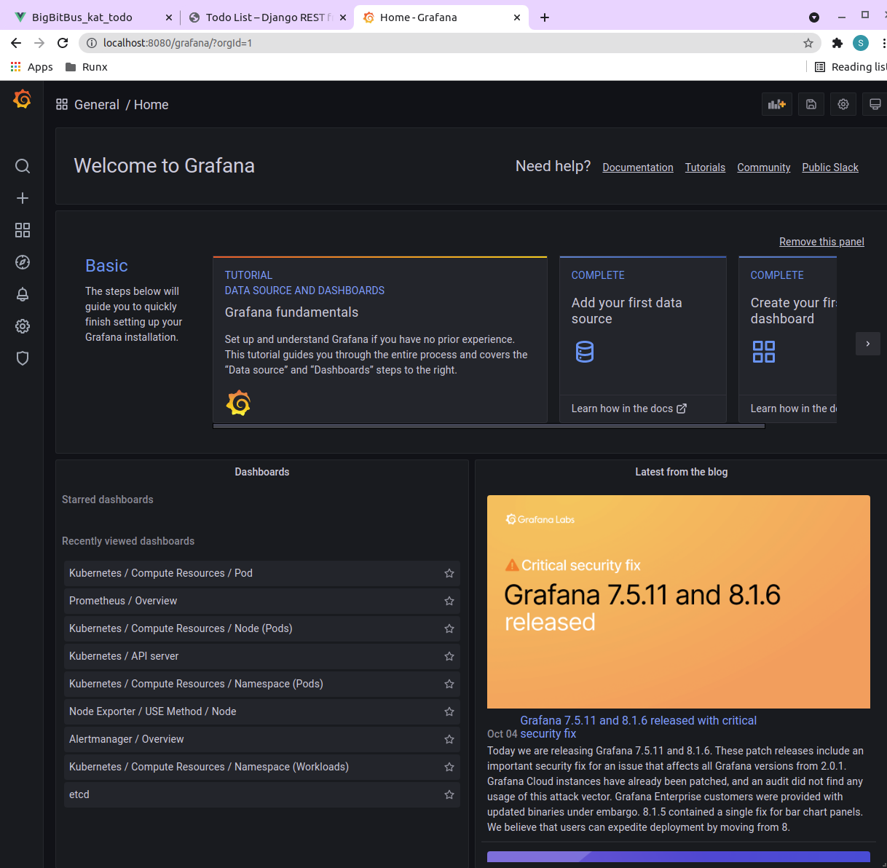

# What is in Here

This full stack example implements a todo list. This folder contains the following sub-folders:

    .
    ├── api                   # Code for an API backend written in Django Web Framework with a Postgres database 
    ├── frontend/todo-vuejs   # Code for a single-page-application that implements the todo list frontend, written in Vuejs
    ├── monitoring            # Opta-based helm installation of the Prometheus/Grafana observability stack
    └── providers             # Infrastructure-as-code via Opta yaml files and Dockerfiles to deploy the application into a provider

Here are some screenshots of what will be deployed:




Lets get started!

# Running the Example

You can build and run the example like so (all paths are relative to this git repository's root directory):

## Build the code docker images:

First, as a developer you can develop the code for the backend and the frontend and create the docker images for your code.

```bash
# Django API
docker build full-stack-example/api/todo-python-django/ --tag todo-api:v1

# Single page application Vuejs Frontend
docker build full-stack-example/frontend/todo-vuejs --tag todo-frontend:v1
```

## Deploy to Local Opta

Deploy the example to a Kubernetes cluster on your local machine. This will create a [Kubernetes Kind cluster](https://kind.sigs.k8s.io/docs/user/quick-start/) and deploy the example on it.  

```bash

# API
opta deploy --image todo-api:v1 --config full-stack-example/api/todo-python-django/opta/opta-api-service.yaml --auto-approve --local

# Frontend
opta deploy --image todo-frontend:v1 --config full-stack-example/frontend/todo-vuejs/opta/opta-frontend-service.yaml --auto-approve --local

```
Optionally, deploy the Prometheus-Grafana observability stack to monitor the infrastructure, like so

```bash
#Monitoring
opta apply --config full-stack-example/monitoring/opta-prometeus-grafana.yaml --auto-approve --local

```

After the deployments are complete you can open your web-browser to see the Todo application [frontend](http://localhost:8080/frontend) and [API backend](http://localhost:8080/djangoapi/apis/v1/). Try adding some items to your todo list frontend and observe the data being stored in the backend API view.

You can also open the [Grafana server gui](http://localhost:8080/grafana) and login using the credentials `admin`/`prom-operator`. After you enable some Kubernetes dashboards, you may need to wait a few minutes for the data to show up.

As a developer, you can repeatedly iterate over the application code, create and tag new docker image versions, and re-deploy the services on your local Kubernetes cluster for testing and development.

### Uninstall Services from Local Environment

```bash
# Destroy Services
opta destroy --config full-stack-example/api/todo-python-django/opta/opta-api-service.yaml --auto-approve --local
opta destroy --config full-stack-example/frontend/todo-vuejs/opta/opta-frontend-service.yaml --auto-approve --local

# Destroy Monitoring
opta destroy --config full-stack-example/monitoring/opta-prometeus-grafana.yaml --auto-approve --local

```

## Deploy to Amazon Web Services

### Create Environment

__Note: While Opta gives you SOC-2 compliant infrastructure, this example is not production ready in terms of application security, please destroy the environment after trying it out.__

Setup the AWS environment like so:

```bash
# Environment (EKS cluster, VPCs etc.)
opta apply --config full-stack-example/providers/aws.yaml --auto-approve
```

### Create/Update Application Code

```bash
# API
opta deploy --image todo-api:v1 --config full-stack-example/api/todo-python-django/opta/opta-api-service.yaml --auto-approve
```

In order for the frontend to connect to the API backend, we need to tell the SPA about the API location on the machine where the browser runs the SPA. Set the correct value of `VUE_APP_DJANGO_ENDPOINT` in `full-stack-example/frontend/todo-vuejs/.env` before building the docker image for the frontend. If you are not using DNS/TLS certificates this would be something like `http://axxxxxxx-yyyyyyyyyy.elb.us-east-1.amazonaws.com`. If you have TLS and DNS configured then use that base URL instead.

Then deploy the frontend into EKS:


```bash
# Frontend
opta deploy --image todo-frontend:v1 --config full-stack-example/frontend/todo-vuejs/opta/opta-frontend-service.yaml --auto-approve 

```
Optionally, deploy the Prometheus-Grafana observability stack to monitor the infrastructure, like so

```bash
# Monitoring
opta apply --config full-stack-example/monitoring/opta-prometeus-grafana.yaml --auto-approve
```

As a developer or production operations engineer, you can repeatedly iterate over the application code, create and tag new docker image versions, and re-deploy the services on AWS.
### Destroy

```bash

# Services
opta destroy --config full-stack-example/api/todo-python-django/opta/opta-api-service.yaml --auto-approve
opta destroy --config full-stack-example/frontend/todo-vuejs/opta/opta-frontend-service.yaml --auto-approve 

# Monitoring
opta destroy --config full-stack-example/monitoring/opta/opta-prometeus-grafana.yaml --auto-approve

# Environment (You can't destroy the environment until the services have been uninstalled using the above 3 commands)
opta destroy --config full-stack-example/providers/aws.yaml --auto-approve

```


# Further Reading

Visit [Opta Documentation](https://docs.opta.dev/)  to learn more.

# Credits

This example is derived from the [Kubernetes Automation Toolkit](https://github.com/BigBitBusInc/kubernetes-automation-toolkit), an open-source learning resource by [BigBitBus Inc](https://www.bigbitbus.com/). 

For more guidance, please reach out to us in our [slack channel](https://slack.opta.dev).
