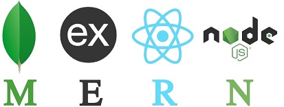
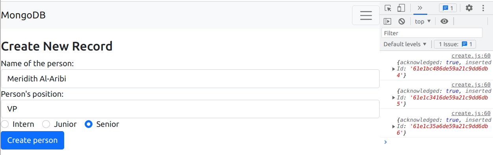
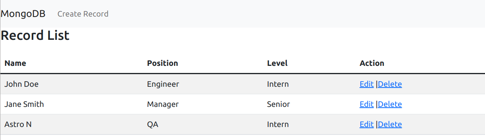

## Introduction

MERN stack is a web software stack that includes MongoDB, Express.js, React, and Node.js. In this post we show how you can use [Opta](https://docs.opta.dev/) to easily stand up a MERN-based application stack on a public cloud (aws) or Local development Kubernetes cluster. Specifically:

1. An [AWS eks/Local PC Kind] Kubernetes cluster built to SOC2 security standards

2. A React single page app, containerized to run in your Kubernetes cluster

3. A Nodejs + Express app, containerized to run in your Kubernetes cluster

4. A MongoDB Atlas cluster to serve as the persistent database layer


## Pre-requisites

Opta is a new kind of Infrastructure-As-Code framework where you work with high-level constructs instead of getting lost in low level cloud configuration or having to deal with [Terraform HCL](https://blog.runx.dev/my-pet-peeves-with-terraform-f9bb37d94950). You can install Opta on your PC by following the instructions [here](https://docs.opta.dev/installation/).

Our MERN stack example is based on the application code created by The MongoDB Atlas team. Their [blog post](https://www.mongodb.com/languages/mern-stack-tutorial) will walk you through the Nodejs+Express backend, React frontend and MongoDB code. You should take a moment to read the blog post, although keep in mind that most of the manual/click-on-GUI steps mentioned in the post to setup the infrastructure are not applicable to this Opta Infrastructure-as-code MERN stack example.

You can choose to deploy the MERN stack application on Kubernetes running in AWS (EKS cluster) or Locally on your laptop ([Kind cluster](https://kind.sigs.k8s.io/docs/user/quick-start/)). AWS will incur cloud charges, but the local Kubernetes setup is completely free. We also use a MongoDB Atlas database, we will sign up for their service and use their a small database (could cost upto $3 per day); you can always scale up the MongoDB deployment for your production code later.


1. Clone the [Opta repo](https://github.com/run-x/opta); the MERN stack example is located in the `opta-mern-stack` sub-directory of the examples directory of this repository.
2. Install Opta, as mentioned above, using [these instructions](https://docs.opta.dev/installation/).
3. Make a MongoDB Atlas account and obtain their [API credentials](https://docs.atlas.mongodb.com/tutorial/manage-programmatic-access?utm_source=runx_opta&utm_campaign=pla&utm_medium=referral); you will need these in your terminal environment to allow Opta to spin up a MongoDB cluster for your application.
4. If you don't already have your cloud credentials (AWS), you can follow the Opta instructions for [AWS](https://docs.opta.dev/getting-started/aws/). If you plan on deploying with Opta [locally](https://docs.opta.dev/getting-started/local/) on your PC, this step is not needed.

So as an example, for AWS, you will inject the API keys into your terminal environment where opta will be invoked like so

```
# Atlas Mongo
export MONGODB_ATLAS_PUBLIC_KEY=”fakeefghij”
export MONGODB_ATLAS_PRIVATE_KEY=”FAKE015e-4503–4f95-f129–543d4e58bsdg”

# AWS
export AWS_ACCESS_KEY_ID=FAKEFTRFFSDQAZA
export AWS_SECRET_ACCESS_KEY=FAKEksfja234sadfbjsdfgsdfg34SAD34fd

```

## Deploy Application

First, we create the Opta environment with the AWS EKS Kubernetes cluster. Sample AWS environment files are included in github repository..

__Note: If you are only trying this out on your local machine, append the — local flag to all subsequent opta commands so that a local Kubernetes cluster is spun up on your machine rather than the AWS EKS cluster. For local runs as well, the MongoDB Atlas Cluster will still be spun up in the cloud.__

Second, we create Docker images for the Nodejs+Express backend and the React frontend, like so:

```
docker build opta/examples/opta-mern-stack/server -t mernapi:latest
docker build opta/examples/opta-mern-stack/client -t mernfrontend:latest
```

As a developer you will build the images containing your application as shown above whenever you want to deploy your application. 


```
# For AWS
opta deploy --image=mernapi:latest -c opta/examples/opta-mern-stack/server/opta-mern-server.yaml 
opta deploy --image=mernfrontend:latest -c opta/examples/opta-mern-stack/client/opta-frontend-server.yaml 

# OR, For local
opta deploy --local --image=mernapi:latest -c opta/examples/opta-mern-stack/server/opta-mern-server.yaml 
opta deploy --local --image=mernfrontend:latest -c opta/examples/opta-mern-stack/client/opta-frontend-server.yaml  
```

After about ~15 minutes Opta should report that your changes have been deployed. 
## Test

If you are running in either of the clouds, lets get the load-balancer endpoint:

```
opta output -c opta/examples/opta-mern-stack/server/opta-mern-server.yaml

# You will see the load_balancer_raw_dns entry at the end: 
    "load_balancer_raw_dns": "opta-atlassearchenv3-lb-abcdefghijklm.elb.us-east-1.amazonaws.com"
}
```

You can now access the frontend in your browser at `http://<load_balancer_raw_dns>/mernfrontend`. As an aside, you can access the API backend at http://<load_balancer_raw_dns>/mernbackend/record.

You should see the React single-page application page.




Click on the top left "MongoDB" image to see the list of records.



As a side note, you can always configure DNS and TLS certificates using Opta for your your production application, as explained [here](https://docs.opta.dev/tutorials/ingress/).

## Teardown

First, destroy the application
```
# For AWS
opta destroy -c opta/examples/opta-mern-stack/server/opta-mern-server.yaml 
opta destroy -c opta/examples/opta-mern-stack/client/opta-frontend-server.yaml 

# OR, For local
opta destroy --local -c opta/examples/opta-mern-stack/server/opta-mern-server.yaml 
opta deestroy --local-c opta/examples/opta-mern-stack/client/opta-frontend-server.yaml  
```


## Conclusion

Take a moment to think of just how much you have built and deployed with a modest amount of effort: a production-grade Kubernetes cluster and MongoDB Atlas database in the cloud supporting a containerized MERN stack scalable application! From local laptop development to a production-grade public cloud Kubernetes deployment, Opta walks alongside you in your development and scaling journey. 


__Credits: The application frontend and backend is largely derived from the [MERN stack tutorial](https://www.mongodb.com/languages/mern-stack-tutorial) by the folks at Mongodb.com. The MERN stack picture is from https://wikitia.com/wiki/File:MERN.jpg__